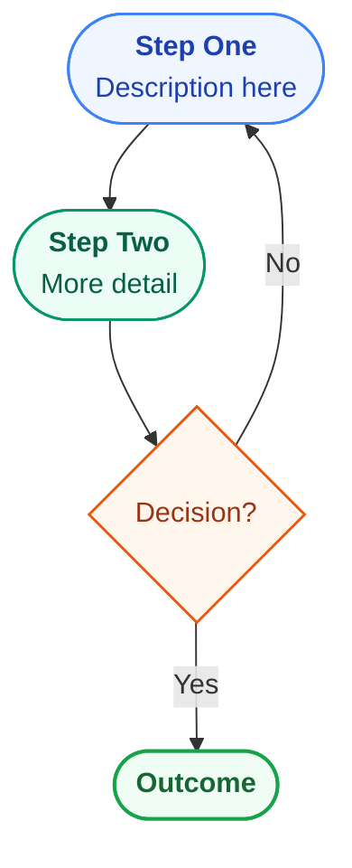

# CLAUDE.md

This file provides guidance to Claude Code when working in this repository.

## Project Overview

**Sustainability Academy** — a multi-course sustainability learning platform built with Next.js 14 (App Router, SSG).
Covers climate science, carbon markets, ESG, clean energy, biodiversity, circular economy, and more.

**Dev server:** `npm run dev` → http://localhost:5001
**Framework:** Next.js 14.2.29, TypeScript, Tailwind CSS, MDX content, YAML quizzes

> The `VM0042_Learning_Module.html` and `index.html` files in the root are the **legacy single-file app** — kept for reference only. Do not edit them.

---

## Repository Structure

```
LearningPlatform/
├── src/
│   ├── app/                          # Next.js App Router pages
│   │   ├── layout.tsx                # Root layout + metadata
│   │   ├── page.tsx                  # Homepage (server component)
│   │   ├── globals.css               # Tailwind + lesson content box styles
│   │   ├── _components/
│   │   │   └── LandingClient.tsx     # Homepage client component
│   │   └── courses/
│   │       └── [courseId]/
│   │           ├── layout.tsx        # Course layout (loads course.yaml)
│   │           ├── page.tsx          # Course overview page
│   │           ├── _components/
│   │           │   ├── CourseShell.tsx       # Sidebar + mobile nav wrapper
│   │           │   └── CourseOverviewClient.tsx
│   │           └── [lessonId]/
│   │               ├── page.tsx              # Lesson page (renders MDX)
│   │               └── _components/
│   │                   └── LessonClient.tsx  # Quiz, progress, nav
│   │
│   ├── components/
│   │   ├── content/                  # MDX content components
│   │   │   ├── mdx-components.tsx    # getMDXComponents() — h2, p, table overrides
│   │   │   ├── HighlightBox.tsx      # Green left-border callout
│   │   │   ├── AnalogyBox.tsx        # Blue left-border analogy
│   │   │   ├── ExampleBox.tsx        # Amber left-border worked example
│   │   │   ├── FormulaBox.tsx        # Dark background formula block
│   │   │   ├── Flowchart.tsx         # Mermaid flowchart renderer (client-side)
│   │   │   ├── EquationBreakdown.tsx # Interactive color-coded equation explainer
│   │   │   └── ResponsiveTable.tsx   # Horizontal-scroll table wrapper
│   │   ├── learning/
│   │   │   ├── Sidebar.tsx           # Course navigation sidebar
│   │   │   ├── Quiz.tsx              # Interactive quiz component
│   │   │   ├── LessonNav.tsx         # Prev / Next lesson buttons
│   │   │   └── ProgressBar.tsx
│   │   └── platform/
│   │       ├── PlatformNav.tsx       # Top nav bar (progress export/import)
│   │       ├── CourseCard.tsx        # Homepage course card
│   │       ├── Breadcrumb.tsx
│   │       └── Footer.tsx
│   │
│   ├── lib/
│   │   ├── types.ts                  # All TypeScript interfaces
│   │   ├── courses.ts                # Server-only: loads course.yaml + quizzes via fs
│   │   ├── url-helpers.ts            # Client-safe URL helpers (no fs)
│   │   ├── progress.ts               # useProgress + usePlatformProgress hooks
│   │   ├── progress-export.ts        # Export/import progress as JSON
│   │   ├── colors.ts                 # colorMap (11 colors)
│   │   └── schemas.ts                # Zod validation schemas
│   │
│   └── content/                      # All course content lives here
│       └── <course-id>/              # One folder per course
│           ├── course.yaml           # Course + module + lesson metadata
│           ├── SOURCES.md            # Which PDFs informed which modules
│           ├── sources/              # Source PDFs (gitignored, kept locally)
│           │   └── *.pdf
│           ├── lessons/              # One .mdx file per lesson
│           │   └── <lessonId>.mdx
│           └── quizzes/              # One .yaml file per lesson (optional)
│               └── <lessonId>.yaml
│
├── scripts/
│   ├── migrate-content.ts            # One-time: HTML → MDX migration
│   └── validate-content.ts           # Validates all content against Zod schemas
│
├── mdx-components.tsx                # Root MDX component map (Next.js convention)
├── next.config.mjs                   # output: 'export', MDX support
├── tailwind.config.ts
└── tsconfig.json                     # target: ES2017, excludes scripts/
```

---

## Development Commands

```bash
npm run dev        # Dev server on http://localhost:5001
npm run build      # Production SSG build (outputs to /out)
npm run validate   # Validate all course content against Zod schemas
npm run migrate    # Re-run content migration (legacy HTML → MDX)
```

---

## Adding a New Course

### 1. Create the content folder

```
src/content/<course-id>/
├── course.yaml
├── SOURCES.md
├── sources/          ← put your source PDFs here
├── lessons/
└── quizzes/
```

### 2. Write `course.yaml`

```yaml
id: esg-fundamentals
title: "ESG Fundamentals"
subtitle: "Understanding Environmental, Social & Governance reporting"
description: "A comprehensive introduction to ESG frameworks, disclosure standards, and corporate sustainability reporting."
icon: "📊"
color: blue            # must exist in src/lib/colors.ts colorMap
status: published      # published | draft | coming-soon
category: esg          # methodologies | esg | markets | fundamentals
estimatedHours: 12
modules:
  - id: 0
    title: "What is ESG?"
    subtitle: "Origins, frameworks, and why it matters"
    icon: "🌍"
    color: blue
    lessons:
      - id: "0.1"
        title: "History and Origins of ESG"
        duration: "45 min"
        vmRef: "GRI Standards 2021, Introduction"   # source document reference
      - id: "0.2"
        title: "The Three Pillars"
        duration: "50 min"
        vmRef: "GRI Standards 2021, Section 2"
```

### 3. Write lesson MDX files

`src/content/esg-fundamentals/lessons/0.1.mdx`:

```mdx
{/* source: GRI Standards 2021, Introduction */}

ESG stands for **Environmental, Social, and Governance**...

<HighlightBox>
Key takeaway: ESG is not just about ethics — it's about long-term risk management.
</HighlightBox>

<AnalogyBox>
Think of ESG like a car's dashboard...
</AnalogyBox>

<ExampleBox>
**Example:** A company with high water usage in a drought-prone region...
</ExampleBox>

<FormulaBox>
Carbon Intensity = Total GHG Emissions (tCO₂e) ÷ Revenue ($ million)
</FormulaBox>
```

Available MDX components:

| Component | Appearance | Use for |
|-----------|-----------|---------|
| `<HighlightBox>` | Green left border | Key takeaways |
| `<AnalogyBox>` | Blue left border | Real-world analogies |
| `<ExampleBox>` | Amber left border | Worked examples |
| `<FormulaBox>` | Dark background | Formulas and equations |
| `<ResponsiveTable>` + `<table>` | Scrollable on mobile | Data tables |
| `<CalculationExercise>` | Violet card, interactive | Practice calculations with hints |
| `<DeepDive>` | Blue collapsible section | Optional deep-dive content |
| `<EquationBreakdown>` | Interactive color-coded equation | Visual formula explainers with hover |
| ` ```mermaid ` code block | Styled flowchart/diagram | Process flows, decision trees |
| `` | Static diagram image | Draw.io exported diagrams (complex visuals) |

**CalculationExercise props:**

| Prop | Type | Required | Description |
|------|------|----------|-------------|
| `question` | string | ✅ | Problem statement shown to the learner |
| `answer` | number | ✅ | Correct numeric answer |
| `tolerance` | number | — | Acceptable absolute deviation (default `0`) |
| `unit` | string | — | Unit label shown after input (e.g. `"tCO₂e"`) |
| `hints` | string[] | — | Progressive hints revealed after each wrong attempt |
| `solution` | string | — | Explanation shown once answer is correct or revealed |

```mdx
<CalculationExercise
  question="A project avoids 10 tonnes of CH₄. What is the CO₂e equivalent? (GWP₁₀₀ = 28)"
  answer={280}
  unit="tCO₂e"
  hints={["Multiply the mass of CH₄ by its GWP.", "10 × 28 = ?"]}
  solution="10 t CH₄ × 28 (GWP₁₀₀) = 280 tCO₂e"
/>
```

**DeepDive props:**

| Prop | Type | Required | Description |
|------|------|----------|-------------|
| `title` | string | — | Button label (default `"Want to go deeper?"`) |
| `children` | ReactNode | ✅ | Content revealed on expand |

```mdx
<DeepDive title="How is GWP calculated?">
  Global Warming Potential compares the heat absorbed by a greenhouse gas...
</DeepDive>
```

**Flowchart / Diagram (Mermaid):**

Flowcharts use standard fenced ` ```mermaid ` code blocks — no imports or special components needed. The `pre` override in `mdx-components.tsx` detects `language-mermaid` code blocks and routes them to the `Flowchart` client component, which renders via Mermaid.js with SVG style injection.

- **Why fenced code blocks?** MDX parses HTML-like syntax (`<br/>`, `<i>`) inside JSX props/children, breaking multi-line Mermaid definitions. Fenced code blocks are opaque to MDX — content passes through untouched.
- **Styling:** The `Flowchart` component applies a base Mermaid theme, then injects a `<style>` block into the rendered SVG for edge labels (dark text, pill background), rounded node corners, and drop shadows.
- **Per-chart colors:** Use Mermaid `style` directives inside the code block (e.g., `style A fill:#eff6ff,stroke:#3b82f6`). Keep to a cohesive palette — pastel fills with matching saturated borders.
- **Edge labels:** Use `-->  |"label text"|` pipe syntax for visible edge labels. Avoid `-- "text" -->` syntax as labels may render invisible depending on theme.
- **Node shapes:** Use `(["text"])` for stadium/pill shapes (modern look), `{"text"}` for diamond decisions.
- **No HTML tags needed in nodes:** Use `<br/>` for line breaks inside node labels (this is Mermaid HTML, not MDX — safe inside code blocks).

````mdx

````

Key files: `src/components/content/Flowchart.tsx` (renderer), `src/components/content/mdx-components.tsx` (pre override that intercepts mermaid blocks).

**Draw.io Diagrams (via `/drawio` skill):**

For complex visual diagrams - multi-step processes, organizational structures, value chain maps, decision frameworks - use the `/drawio` skill to create professional `.drawio` files and export them as PNG images. These are more visually polished than Mermaid and better suited for diagrams that benefit from precise layout, color-coded steps, and custom styling.

- **When to use Draw.io over Mermaid:** Use Draw.io when the diagram needs precise spatial layout (e.g., a U-shaped six-step process with iterative arrows), multiple colors per node, or when Mermaid syntax becomes unwieldy. Use Mermaid for simpler linear flows and decision trees.
- **Workflow:** Use the `/drawio` skill to create the `.drawio` file in the project root, export to PNG, then place the PNG in `public/images/<course-id>/`.
- **File convention:** Save exported PNGs to `public/images/<course-id>/<descriptive-name>.png` (e.g., `public/images/ghg-scope-3/six-step-accounting-process.png`).
- **In MDX:** Reference with a standard Markdown image: ``
- **When to create diagrams:** Proactively create Draw.io diagrams for multi-step processes, frameworks, hierarchies, and visual overviews that help learners grasp structure at a glance - especially in introductory or summary lessons.
- **Avoid arrow/label overlaps:** When routing edges between nodes, verify that the arrow path and its label do not pass through or overlap any box. Use explicit entry/exit points (`entryX`, `entryY`, `exitX`, `exitY`) and waypoints to route arrows around boxes, not through them. For example, if two nodes are at the same vertical center, connect them side-to-side (`exitX=1;exitY=0.5` to `entryX=0;entryY=0.5`) rather than routing through intermediate coordinates that land inside another node. After export, visually inspect the PNG for overlaps before committing.

```mdx

```

**EquationBreakdown (Visual Equation Explainer):**

Renders equations as interactive, color-coded visual breakdowns. Each variable gets a colored pill in the equation row and a matching explanation card below. Hovering any pill or card highlights the pair and fades the rest.

- **Props are strings** (not objects/arrays) because MDX cannot reliably parse nested objects or arrays in JSX props.
- **`result`**: pipe-delimited string - `"symbol | label | description | color"`
- **`inputs`**: multiple inputs separated by `;;` - each is `"symbol | label | description | color"`
- **Available colors**: `blue`, `green`, `amber`, `violet`, `rose`, `cyan`, `orange`
- **HTML in symbols**: Use `<sub>` for subscripts (e.g. `EF<sub>CO₂</sub>`). Safe because these are rendered via `dangerouslySetInnerHTML`.
- **`operator`**: defaults to `×`. Set to `+` or other operators as needed.

```mdx
<EquationBreakdown
  title="Equation 6 - Fossil Fuel CO₂"
  result="EFF<sub>j</sub> | Fossil Fuel Emissions | Total CO₂ from fuel, tCO₂/ha/yr | blue"
  inputs="FFC<sub>j</sub> | Fuel Consumption | Litres of fuel burned per hectare per year | green ;; EF<sub>CO₂</sub> | Emission Factor | tCO₂ per litre of fuel burned | amber"
/>
```

Key file: `src/components/content/EquationBreakdown.tsx`

### 4. Write quiz YAML files (optional per lesson)

`src/content/esg-fundamentals/quizzes/0.1.yaml`:

```yaml
- question: "What does the 'E' in ESG stand for?"
  options:
    - "Economic"
    - "Environmental"
    - "Equity"
    - "Ethical"
  answer: 1          # 0-based index into options
  explanation: "The E stands for Environmental, covering climate, water, and biodiversity impacts."

- question: "Which year were the GRI Standards first published?"
  options:
    - "1997"
    - "2000"
    - "2006"
    - "2016"
  answer: 0
  # explanation is optional
```

### 5. Create `SOURCES.md`

Document which PDF (or other source) informed each module. See `src/content/vm0042/SOURCES.md` as a template.

### 6. Validate and run

```bash
npm run validate   # should report 0 errors
npm run dev        # check at http://localhost:5001
```

---

## Available Colors

Defined in `src/lib/colors.ts`. Each color has `bg`, `text`, `border`, `btn`, `active`, `light` Tailwind classes.

| Name | Hue |
|------|-----|
| `green` | Green |
| `emerald` | Emerald |
| `teal` | Teal |
| `blue` | Blue |
| `violet` | Violet |
| `orange` | Orange |
| `red` | Red |
| `purple` | Purple |
| `cyan` | Cyan |
| `rose` | Rose |
| `indigo` | Indigo |

To add a new color, add it to `colorMap` in `src/lib/colors.ts` with all six keys.

---

## Content Verification Workflow

After writing or editing lessons against source PDFs, verify accuracy:

```bash
# Gemini — factual accuracy vs PDF
gemini -p "Review src/content/vm0042/lessons/3.1.mdx against src/content/vm0042/sources/VM0042v2.2.pdf Section 8.1. Check all formulas, thresholds, and tables. Rate depth 1–10."

# Codex — line-by-line accuracy + clarity improvements
codex exec -c 'sandbox_permissions=["disk-full-read-access"]' "Review src/content/vm0042/lessons/3.1.mdx against src/content/vm0042/sources/VM0042v2.2.pdf Section 8.1. Check all values and suggest wording improvements."
```

Both CLIs can read PDFs directly from the `sources/` path.

---

## Key Architectural Rules

- **`src/lib/courses.ts` uses Node.js `fs`** — never import it in client components. Use `src/lib/url-helpers.ts` for URL functions in client code.
- **`'use client'` components** must defer all localStorage reads to after mount via `useEffect` (hydration safety).
- **Lesson IDs are strings** (`"0.1"`, `"CAP"`). URL params replace `.` with `_` (`0.1` → `0_1`). See `lessonIdToUrl` / `urlToLessonId` in `url-helpers.ts`.
- **`dynamicParams = false`** is set on both `[courseId]` and `[lessonId]` routes — all paths must be returned by `generateStaticParams`.
- **Quiz `answer` is 0-based** index into the `options` array.
- **`explanation` is optional** in quiz YAML — omit the field entirely if not needed.
- **MDX self-closing tags required** — use `<br />` not `<br>`. Unescaped `<` before numbers must be `&lt;`.
- **Source PDFs** live in `src/content/<course-id>/sources/` and are gitignored. Never commit PDFs to git.

---

## localStorage Schema

Key: `sustainability_academy`

```json
{
  "version": 2,
  "courses": {
    "<courseId>": {
      "startedAt": 1234567890,
      "lastAccessedAt": 1234567890,
      "lastAccessedLesson": "3.2",
      "completedLessons": { "0.1": 1234567890 },
      "quizzes": {
        "0.1": { "answers": { "0": 2 }, "submitted": { "0": true } }
      }
    }
  }
}
```

Legacy keys `vm0042_progress` and `vm0042_quiz_*` are auto-migrated on first load.
