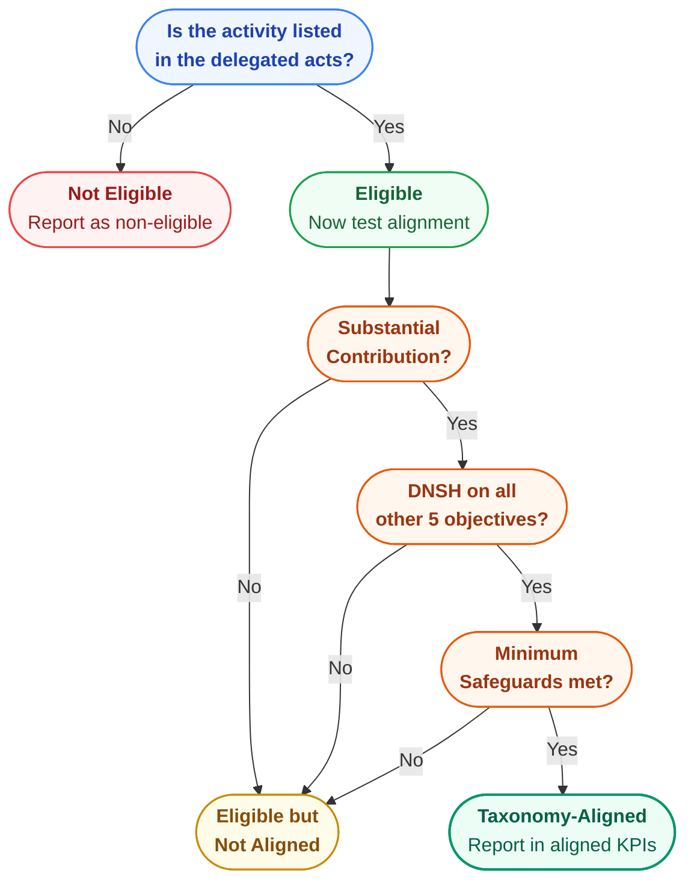

{/* source: Regulation (EU) 2020/852, Art. 3; Disclosures Delegated Act */}

## The Most Misunderstood Distinction in EU Sustainable Finance

These two terms sound similar but mean completely different things. Getting them confused will produce misleading disclosures.

**Taxonomy-eligible:** The activity is described in the delegated acts. It appears in the list. That's it. It says nothing about whether the activity is green - only that the taxonomy has criteria for it.

**Taxonomy-aligned:** The activity is eligible AND it meets all four conditions - substantial contribution, DNSH, minimum safeguards, and technical screening criteria. This is the real bar.

<AnalogyBox>
Eligibility is like being on the menu at a restaurant. Alignment is actually passing the food safety inspection. Being on the menu means someone has written standards for your dish. Passing the inspection means your dish meets those standards.
</AnalogyBox>

## Why the Gap Matters

A company might report: "70% of our turnover is taxonomy-eligible, but only 20% is taxonomy-aligned."

That gap tells you something important: 50% of the company's covered activities don't currently meet the sustainability criteria. This could be because emissions are too high, DNSH conditions aren't met, or minimum safeguards aren't in place.

The gap between eligibility and alignment is informative, not embarrassing. It shows where the company's transition opportunities lie.

<ExampleBox>
**A cement company:** Cement manufacturing is taxonomy-eligible under the Climate Delegated Act. But to be taxonomy-aligned for climate mitigation, the company's clinker production must emit below 0.469 tCO2e per tonne. If the plant emits 0.6 tCO2e per tonne, the activity is eligible but not aligned. The company reports it in the eligible column and discloses what it would take to reach alignment.
</ExampleBox>

## The Four Conditions for Alignment

An economic activity qualifies as environmentally sustainable (taxonomy-aligned) only if it meets **all four** conditions:

1. **Substantially contributes** to at least one of the six environmental objectives
2. **Does no significant harm (DNSH)** to any of the other five objectives
3. **Complies with minimum safeguards** on human rights and labour standards
4. **Meets the technical screening criteria** set out in the delegated acts

Fail any one of these, and the activity is not aligned - even if it passes the other three.

<KeyTakeaways items="Taxonomy-eligible means the activity is listed in the delegated acts - it says nothing about whether it is sustainable ;; Taxonomy-aligned means the activity passes all four tests: substantial contribution, DNSH, minimum safeguards, and technical screening criteria ;; The gap between eligibility and alignment shows transition opportunities, not failure ;; All four conditions must be met simultaneously - failing any single one means the activity is not aligned" />
