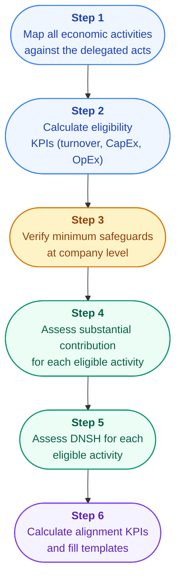

{/* source: Disclosures Delegated Act Annexes; EC FAQ */}

## The Reporting Templates

The Disclosures Delegated Act prescribes standardised templates for taxonomy reporting. Companies don't get to design their own format - they fill in prescribed tables.

The templates require disclosure of:

- **Eligible vs. aligned** percentages for each KPI (turnover, CapEx, OpEx)
- **Breakdown by environmental objective** - which of the six objectives each aligned activity contributes to
- **Transitional and enabling** activities identified separately
- **Nuclear and gas** activities disclosed in separate rows (if applicable)

## Common Pitfalls

### 1. Double Counting Across Objectives

An activity can contribute to multiple objectives, but the KPI must not double-count. If an activity contributes to both mitigation and circular economy, the company chooses the primary objective and reports it once.

### 2. Mixing Eligibility and Alignment

In early reporting years, some companies reported eligibility percentages as if they were alignment figures. The difference matters enormously. Always be clear about which number you are presenting.

### 3. Getting the Denominators Wrong

The denominator for turnover is straightforward (total net revenue). But the CapEx and OpEx denominators have specific definitions from IAS/IFRS accounting standards. Using the wrong denominator inflates or deflates the KPI.

### 4. Ignoring DNSH

Companies sometimes assess substantial contribution but skip or superficially address DNSH. An activity that meets the emissions threshold but doesn't have a climate risk assessment (adaptation DNSH) cannot be reported as aligned.

### 5. Forgetting Minimum Safeguards

Minimum safeguards are assessed at the company level but often treated as an afterthought. If your company has no human rights due diligence process, none of your activities can be reported as aligned.

<HighlightBox>
**Practical tip:** Start your taxonomy assessment with minimum safeguards. If the company doesn't meet them, no activity can be aligned - and you save yourself the effort of detailed activity-by-activity assessment. Fix the safeguards first, then assess activities.
</HighlightBox>

## The Assessment Workflow

Here is the practical sequence most companies follow:

<KeyTakeaways items="Use the prescribed reporting templates from the Disclosures Delegated Act - companies cannot design their own format ;; Avoid double counting: if an activity contributes to multiple objectives, report it under the primary one only ;; Start with minimum safeguards assessment - if the company fails here, no activities can be aligned and you save unnecessary work ;; The most common pitfalls are mixing eligibility with alignment, getting denominators wrong, skipping DNSH, and forgetting minimum safeguards" />
