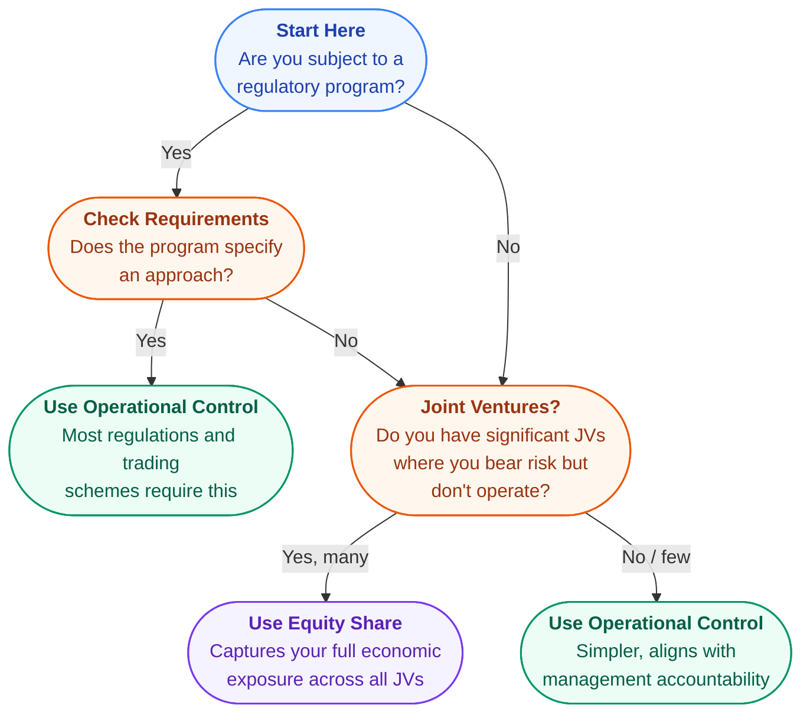

{/* source: ghg-protocol-revised.pdf, Chapter 3 (pp. 16-23), Chapter 4 (pp. 24-33) */}

## Setting Boundaries: The First Real Decision

Before you collect a single data point, you need to answer two questions: **which parts of the business are in scope?** (organisational boundary) and **which types of emissions do you count?** (operational boundary). Get these wrong and your entire inventory is built on the wrong foundation.

This is where GHG accounting stops being theoretical and starts requiring real judgment calls. Joint ventures, subsidiaries, leased assets, outsourced operations - every corporate structure creates boundary questions that need clear answers.

## Organisational Boundaries: Who Is "The Company"?

Business operations come in many forms: wholly owned subsidiaries, joint ventures, partnerships, franchises. Setting your organisational boundary means deciding which of these are included in your GHG inventory.

The GHG Protocol gives you two approaches. You must pick one and apply it consistently across your entire organisation.

**Equity Share Approach:** You account for emissions in proportion to your ownership stake. Own 40% of a joint venture? You report 40% of its emissions.

**Control Approach:** You account for 100% of emissions from operations you control, and 0% from operations where you have an interest but no control. Control can be defined two ways:

- **Financial control** - you can direct the financial and operating policies of the operation
- **Operational control** - you have the authority to introduce and implement operating policies (i.e., you hold the operating licence)

<AnalogyBox>
Think of equity share like owning shares in a company. If you own 40% of a joint venture, you receive 40% of the profits and bear 40% of the losses. Under the equity share approach, you also account for 40% of its emissions. Under the control approach, it is all or nothing: if you run the operations, you report 100%. If someone else runs them, you report 0%.
</AnalogyBox>

### The Holland Industries Example

This classic example shows why the choice of approach matters. Holland Industries is a chemicals group with several subsidiaries and joint ventures. Watch how the same corporate structure produces different numbers under each approach:

<ResponsiveTable>
<table>
  <thead>
    <tr>
      <th>Operation</th>
      <th>Equity Interest</th>
      <th>Who Controls</th>
      <th>Equity Share %</th>
      <th>Operational Control %</th>
      <th>Financial Control %</th>
    </tr>
  </thead>
  <tbody>
    <tr>
      <td>Holland Switzerland (100% subsidiary)</td>
      <td>100%</td>
      <td>Holland Industries</td>
      <td>100%</td>
      <td>100%</td>
      <td>100%</td>
    </tr>
    <tr>
      <td>Holland America (83% subsidiary)</td>
      <td>83%</td>
      <td>Holland Industries</td>
      <td>83%</td>
      <td>100%</td>
      <td>100%</td>
    </tr>
    <tr>
      <td>BGB (50% owned, partner Rearden controls)</td>
      <td>41.5%</td>
      <td>Rearden</td>
      <td>41.5%</td>
      <td>0%</td>
      <td>50%</td>
    </tr>
    <tr>
      <td>IRW (75% subsidiary of Holland America)</td>
      <td>62.25%</td>
      <td>Holland America</td>
      <td>62.25%</td>
      <td>100%</td>
      <td>100%</td>
    </tr>
    <tr>
      <td>Kahuna Chemicals (33.3% non-incorporated JV)</td>
      <td>33.3%</td>
      <td>Holland Industries</td>
      <td>33.3%</td>
      <td>100%</td>
      <td>33.3%</td>
    </tr>
    <tr>
      <td>Nallo (56% owned, treated as associate)</td>
      <td>56%</td>
      <td>Nallo</td>
      <td>56%</td>
      <td>0%</td>
      <td>0%</td>
    </tr>
    <tr>
      <td>Syntal (1% fixed asset investment)</td>
      <td>0%</td>
      <td>Erewhon Co.</td>
      <td>0%</td>
      <td>0%</td>
      <td>0%</td>
    </tr>
  </tbody>
</table>
</ResponsiveTable>

Notice the key differences. Under **equity share**, Holland reports 56% of Nallo's emissions even though it does not control it. Under **operational control**, Nallo drops to 0% because Nallo runs its own operations. Meanwhile, Kahuna Chemicals (only 33.3% owned) shows up at 100% under operational control because Holland runs the plant.

The same company, the same year, and different boundary approaches can produce materially different totals. That is why transparency about your chosen approach matters.

<DeepDive title="How to determine which approach applies to a specific operation">

The three approaches - equity share, operational control, and financial control - sound straightforward in theory. In practice, figuring out which one applies to a specific joint venture or subsidiary requires asking a few pointed questions.

**Equity share** is the simplest to determine. Look at the shareholder agreement or corporate structure chart. Your equity share is your percentage of economic interest - the proportion of profits, losses, and risks you bear. If you own 40% of a JV and are entitled to 40% of its economic output, your equity share is 40%. For wholly owned subsidiaries, it is always 100%.

**Operational control** requires a more practical test. Ask: who holds the operating licence? Who has the authority to set environmental, health, and safety policies at the facility? Who decides how the plant runs on a day-to-day basis? If your company can introduce and implement operating policies - even if you own less than 50% - you have operational control and report 100% of that operation's emissions.

Key indicators of operational control:
- Your company holds the operating permit or environmental licence
- Your managers run the facility day-to-day
- Your company sets the HSE policies and procedures
- Your employees (not the partner's) are on-site managing operations

**Financial control** is the trickiest. You have financial control if you can direct the financial and operating policies of the operation with a view to gaining economic benefits. In practice, this usually means:
- You own more than 50% of voting rights, OR
- You have the power to appoint or remove a majority of the board, OR
- You have the right to the majority of economic benefits (and bear the majority of risks)

The distinction between financial and operational control matters most in joint ventures where one partner provides the capital (financial control) while another runs the facility (operational control). In the Holland Industries example, BGB shows 50% under financial control but 0% under operational control because partner Rearden runs the plant.

**A practical shortcut:** If your company's financial statements consolidate an entity (under IFRS or GAAP), you almost certainly have financial control over it. If your company's operations team manages a facility, you have operational control. If you are just an investor receiving dividends, use equity share.
</DeepDive>

<HighlightBox>
**Practitioner Tip: Align Your Boundary with Your Report**

Your organisational boundary must mirror the financial reporting boundary of whatever report the inventory sits in. If your BRSR or sustainability report presents data on a standalone basis (entity only), exclude subsidiaries from the GHG inventory. If it is consolidated, include them. A mismatch between the GHG boundary and the financial reporting boundary is one of the most common issues flagged during assurance - and one of the easiest to avoid by deciding this upfront.
</HighlightBox>

### Which Approach Do Most Companies Use?

In practice, **operational control** is the most common choice, for three reasons:

1. Regulatory programs and trading schemes usually require it - compliance responsibility falls on the operator
2. It aligns with management accountability - you report what you actually run
3. It avoids the complexity of calculating fractional equity shares across dozens of entities

**Equity share** is preferred when the goal is financial reporting alignment, or when a company has significant joint ventures where it bears economic risk but does not operate.

<ExampleBox>
**BP** reports on an equity share basis, capturing its proportional stake in operations it does not operate. **Shell** reports on operational control, accounting for 100% of emissions from ventures it runs regardless of equity share. Both are valid. The key requirement is consistent, transparent application across the entire organisation.
</ExampleBox>

## Operational Boundaries: The Three Scopes

Once you know which entities are in your inventory, you need to classify their emissions. The GHG Protocol uses three scopes to separate direct emissions from indirect ones.

**Scope 1 - Direct emissions** from sources you own or control. These come from four types of activity:

- **Stationary combustion** - boilers, furnaces, turbines, generators
- **Mobile combustion** - company-owned vehicles (trucks, cars, ships, aircraft)
- **Process emissions** - chemical or physical processes (e.g., CO2 from cement clinker production)
- **Fugitive emissions** - leaks from equipment, refrigerant losses, methane from coal mines

**Scope 2 - Purchased electricity** (indirect). These emissions physically occur at the power station, not at your facilities. But because you created the demand by purchasing the electricity, you account for the associated emissions.

**Scope 3 - Everything else** (indirect). All other emissions caused by your activities but occurring at sources you do not own or control. Employee commuting, business travel, purchased materials, product use by customers - all Scope 3. Reporting Scope 3 is encouraged but voluntary under the Corporate Standard.

<HighlightBox>
Companies **shall** separately account for and report Scopes 1 and 2 at a minimum. Scope 3 is optional but often where the majority of emissions sit - especially for services and asset-light businesses.
</HighlightBox>

<AnalogyBox>
Think of the three scopes like concentric rings. The innermost ring (Scope 1) is emissions from your own chimneys and tailpipes. The middle ring (Scope 2) is emissions your electricity supplier generates on your behalf. The outermost ring (Scope 3) is everything else in your value chain - upstream suppliers, downstream customers, and all the activity in between. Each ring is "owned" by a different company, which prevents double counting.
</AnalogyBox>

### Why This Prevents Double Counting

A power station generates electricity and releases 20 tonnes of CO2. It reports those 20 tonnes as its Scope 1. The company that buys the electricity reports the associated emissions as its Scope 2. Same physical CO2, but counted in different scopes by different companies. No double counting within any single scope.

### When Scope 3 Changes Everything

For many companies, Scope 3 dwarfs Scopes 1 and 2 combined. Ignoring it can mean ignoring 90%+ of your real climate impact.

<ExampleBox>
**DHL Express Nordic** found that **98% of its emissions** in Sweden came from outsourced partner transportation firms. Their reported breakdown: Scope 1: 7,265 tCO2 / Scope 2: 52 tCO2 / Scope 3: 327,634 tCO2 / Total: 334,951 tCO2. Without Scope 3, DHL would have reported just 2% of its actual footprint. By requiring transport partners to submit vehicle and fuel data, DHL built a detailed picture that unlocked real reduction opportunities.
</ExampleBox>

## How to Decide in 5 Minutes

Choosing your boundary approach does not have to be agonising. Here is a practical decision path:

<HighlightBox>
**Common Boundary Mistakes**

1. **Mixing approaches across the organisation.** Some subsidiaries on equity share, others on operational control. This creates gaps and overlaps. Pick one approach and apply it everywhere.

2. **Excluding subsidiaries without disclosing it.** If a subsidiary is within your boundary but you leave it out (e.g., due to lack of data), you must disclose the exclusion and explain why. Silent omissions violate completeness.

3. **Confusing Scope 1 and Scope 2 for captive power.** If your company owns a power plant that generates electricity for your own facilities, those emissions are Scope 1 (you own the source), not Scope 2. This trips up companies with on-site generation.

4. **Forgetting leased assets.** A leased warehouse or vehicle fleet needs to be classified using your chosen boundary approach. Under operational control, if you operate it, it is in scope. If not, it goes to Scope 3.
</HighlightBox>

<HighlightBox>
**Practitioner Tip: The Operational Control Test for Leased Assets**

When you encounter a gray-area asset - a leased warehouse, contract manufacturing facility, franchise outlet, or leased vehicle fleet - the practical question is: **do you control how it operates?** Can you choose the fuel source? Can you set the operating policies? If yes, it falls within your operational boundary (Scope 1/2), regardless of who owns the asset. If no, it belongs in Scope 3. The answer almost always comes from reading the contract terms, not from looking at the balance sheet. Common assets that catch companies off guard: forklifts on lease, third-party warehouses under long-term contracts, and franchise models where the franchisor dictates equipment and fuel standards.
</HighlightBox>

## Putting It All Together

Your **inventory boundary** is the combination of your organisational boundary (which entities) and your operational boundary (which scopes). Together, they define the complete perimeter of your GHG inventory.

Getting boundaries right is not glamorous work. But it is the foundation everything else builds on - your calculations, your targets, your reductions, your public disclosures. Take the time to get it right in year one, document your choices clearly, and future years become straightforward.

<KeyTakeaways items="Organisational boundaries define which entities are in your inventory - choose equity share, operational control, or financial control and apply it consistently ;; Operational control is the most common approach because it aligns with regulatory programs, management accountability, and avoids fractional equity calculations ;; The three scopes - direct (Scope 1), purchased electricity (Scope 2), and value chain (Scope 3) - prevent double counting by assigning emissions to different companies ;; The same corporate structure can produce materially different totals under different boundary approaches, so transparency about your chosen method is essential ;; For many companies, Scope 3 dwarfs Scopes 1 and 2 combined - ignoring it can mean ignoring 90%+ of actual climate impact ;; Pick one boundary approach and apply it everywhere - mixing approaches across subsidiaries creates gaps and overlaps" />
