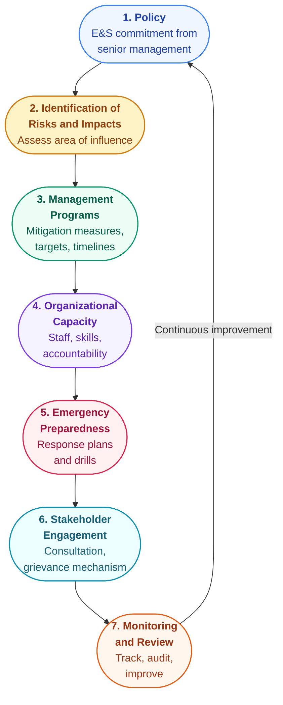

{/* PS 1, paragraphs 1-24 */}

## Why PS1 Is the Foundation

Performance Standard 1 is the standard that makes all the other standards work. PS2 through PS8 each deal with a specific topic - labor, pollution, community safety, land, biodiversity, indigenous peoples, cultural heritage - but PS1 is the management system that holds them all together.

The core requirement is simple: every project that receives IFC financing must establish and maintain an **Environmental and Social Management System (ESMS)**. This is not a document you write once and file away. It is an operational system with seven defined elements that together form a continuous improvement cycle.

If you have worked with ISO 14001 or any quality management system, the structure will feel familiar. It follows the classic **Plan-Do-Check-Act** cycle, applied specifically to environmental and social risks.

## The Seven Elements of the ESMS

Let's walk through each element and what it means in practice.

### 1. Policy

The starting point is an overarching Environmental and Social (E&S) policy. This is a commitment statement endorsed by senior management that sets the direction for how the project will manage E&S risks.

The policy must be communicated to all levels of the organization. It is not enough for the CEO to sign it and put it in a drawer - workers on the ground need to know it exists and what it means for their daily work.

### 2. Identification of Risks and Impacts

This is where the real analytical work happens. The project must systematically identify all E&S risks and impacts - not just within the project fence line, but across the entire **area of influence**.

The area of influence is a broader concept than most people expect. It includes:

- **(i) The project site and related facilities** - the obvious part
- **(ii) Unplanned but predictable developments** - things that are likely to happen because the project exists, like settlements growing around a new road
- **(iii) Indirect impacts on biodiversity and ecosystem services** - downstream effects the project might trigger

<ExampleBox>
**A coal-fired power plant project.** The area of influence is not just the plant itself. It extends to the transmission lines connecting it to the grid, the access roads built to reach the site, the ash disposal ponds, and the coal supply chain. If the transmission line passes through a forest, that forest is part of the area of influence. If the ash pond is near a river, downstream water quality is in scope. If a new settlement forms near the access road, the social impacts on that settlement count too.

This is why the area of influence assessment often surprises project sponsors - the boundary of what you are responsible for is much wider than the project footprint.
</ExampleBox>

The assessment must also identify **disadvantaged or vulnerable groups** who may be disproportionately affected by the project. This includes people who, because of their gender, age, ethnicity, disability, or economic status, may experience impacts more severely or have less ability to participate in consultation processes.

### 3. Management Programs

Once you have identified the risks, you need documented programs to manage them. Each program must include:

- **Mitigation measures and actions** to address each identified risk
- **Performance indicators** so you can measure whether the measures are working
- **Targets and timelines** for achieving those indicators

<HighlightBox>
The **mitigation hierarchy** applies throughout everything you do under the ESMS. The order of priority is: **avoid** the impact entirely first. If you cannot avoid it, **minimize** it as much as possible. Only after exhausting avoidance and minimization should you **compensate or offset** for residual impacts. This hierarchy is not a suggestion - IFC expects you to demonstrate that you followed it in sequence.
</HighlightBox>

### 4. Organizational Capacity and Competency

Having a management program on paper means nothing if nobody is responsible for implementing it. PS1 requires the project to:

- **Designate a management representative** (or representatives) with clear authority and accountability for E&S performance
- **Ensure staff have the knowledge, skills, and training** to carry out their E&S responsibilities
- **Provide adequate resources** (budget, personnel, equipment) to implement the ESMS

In practice, this is where many projects fall short. The ESMS document looks great, but nobody has been given the time, authority, or budget to actually run it.

### 5. Emergency Preparedness and Response

The project must identify areas where accidents and emergencies may occur and develop response procedures. This covers both industrial emergencies (spills, fires, equipment failures) and natural hazards.

Key requirements include:

- Documented emergency response procedures
- Equipment and resources to execute those procedures
- Regular training and drills
- **Procedures to assist Affected Communities** in the event of an emergency - this is often overlooked, but IFC explicitly requires it

### 6. Stakeholder Engagement

Stakeholder engagement is important enough that it gets its own lesson (next up). The short version: it must be an ongoing, two-way process that includes disclosure, consultation, a grievance mechanism, and periodic reporting to affected communities.

### 7. Monitoring and Review

The final element closes the loop. The project must:

- **Track and measure** E&S performance against the management programs
- Conduct **internal inspections and audits** to verify compliance
- Ensure **senior management reviews** the ESMS periodically and makes adjustments

This is the "Check" and "Act" part of the cycle. Without monitoring, you have no way of knowing whether your management programs are actually working. Without review, you have no mechanism to improve them.

## The ESIA Process: Seven Key Elements

The Environmental and Social Impact Assessment (ESIA) is the primary tool used under Element 2 (Identification of Risks and Impacts). Guidance Note 1 outlines seven elements that a compliant ESIA should cover, whether as a single integrated assessment or as a series of linked studies.

1. **Scoping of key issues** - Identify the most significant E&S issues early so that the full assessment focuses resources where they matter. Scoping should involve preliminary stakeholder input and a review of applicable regulatory requirements and Performance Standards.

2. **Baseline data collection** - Gather data on the current state of the physical, biological, and social environment in the project's area of influence. This is your reference point for measuring future change. Without a solid baseline, you cannot demonstrate whether impacts occurred or whether mitigation worked.

3. **Impact prediction and significance assessment** - For each identified risk, predict the likely magnitude, spatial extent, duration, and reversibility of the impact. Then assess its significance - not every impact is equally important, and the ESIA must distinguish between minor and material risks.

4. **Cumulative and associated impacts** - Assess how the project's impacts combine with impacts from other existing and planned developments in the same area (see the Cumulative Impact Assessment section below).

5. **Analysis of alternatives** - Evaluate feasible alternatives to the proposed project design, technology, siting, and operations. This must include the **"no project" alternative** - what happens if the project does not go ahead. The analysis should explain why the chosen option was selected and why alternatives were rejected.

6. **Mitigation measures design** - For each significant impact, define specific measures following the mitigation hierarchy (avoid, minimize, compensate/offset). Measures must be practical, implementable, and linked to clear responsibilities and timelines.

7. **Monitoring and management framework** - Define how the project will track whether mitigation measures are working, what indicators will be measured, how often, and who is responsible. This feeds directly into Element 7 (Monitoring and Review) of the ESMS.

<HighlightBox>
The ESIA is not a one-time exercise. For projects with long construction or operational phases, PS1 expects the assessment to be updated as conditions change, new information becomes available, or the project design evolves. The ESMS must include procedures for periodic review and updating of the risk identification process.
</HighlightBox>

## Cumulative Impact Assessment

One of the most demanding requirements in Guidance Note 1 is the expectation that projects assess **cumulative impacts** - impacts that result from the incremental impact of the project when added to other existing, planned, and reasonably predictable future developments.

This means you cannot assess your project in isolation. If you are building a hydropower dam on a river where two other dams already exist and a third is planned, your ESIA must consider the combined effect on downstream water flows, fish migration, and community water access - not just your dam's contribution alone.

<ExampleBox>
**Cumulative impacts in practice.** A new palm oil processing facility is proposed in a region where three other facilities already operate and deforestation has been ongoing for a decade. The project's own land clearance may be modest - say 500 hectares. But the cumulative impact assessment must consider the combined effect of all facilities on regional biodiversity, water quality, and community displacement. The 500 hectares may push the total cleared area past a threshold that triggers irreversible habitat loss. Without the cumulative lens, this tipping point would be invisible.
</ExampleBox>

Cumulative impact assessments are challenging because they require data on other projects and developments that the project sponsor does not control. GN1 acknowledges this difficulty but still expects a good-faith effort to gather available information and assess combined effects. Where data gaps exist, the assessment should note them and apply the precautionary principle.

## Climate Change Vulnerability

PS1 requires the ESIA to consider climate change in two directions:

- **Climate risks to the project** - How might changing temperatures, precipitation patterns, sea level rise, or extreme weather events affect the project's infrastructure, operations, and supply chains over its lifetime? A coastal industrial facility designed for current sea levels may face very different conditions 20 years from now.

- **Project impacts on climate vulnerability** - How might the project exacerbate the climate vulnerability of surrounding communities? A project that diverts water upstream may reduce the adaptive capacity of downstream communities facing increasing drought. A project that clears forests removes carbon sinks and flood buffers that communities depend on.

This two-way analysis reflects a growing recognition that E&S risk assessment cannot treat the climate as static. Projects with long operational lifespans must demonstrate they have considered climate scenarios relevant to their geography and sector.

## Area of Influence: Four Components

The area of influence concept is central to PS1 and broader than most project sponsors initially expect. Guidance Note 1 defines four components:

<ResponsiveTable>

| Component | What It Covers | Example |
|-----------|---------------|---------|
| **Direct footprint** | The project site and all areas directly used or affected by project activities | The plant site, access roads built by the project, laydown areas, worker camps |
| **Associated facilities** | Facilities not funded by the project but without which the project would not be viable, and vice versa | A third-party port expansion built specifically to handle the project's exports; a government-built road upgrade essential for project logistics |
| **Cumulative impact areas** | Areas where the project's impacts overlap with impacts from other existing and planned developments | A shared river basin, an airshed affected by multiple industrial sources, a migration corridor fragmented by multiple projects |
| **Unplanned but predictable developments** | Developments that are not part of the project but are reasonably foreseeable consequences of it | Informal settlements growing around a new mine; increased traffic and commercial activity along a new project road; speculative land clearing near a new agricultural processing facility |

</ResponsiveTable>

<AnalogyBox>
Think of the area of influence like the ripples from a stone dropped in water. The stone itself is the project site (direct footprint). The first ring of ripples represents associated facilities - things directly connected to the project. The second ring is cumulative impacts - where your ripples meet ripples from other stones. The third ring is unplanned but predictable developments - effects that radiate outward in ways you did not intend but should have anticipated. IFC expects you to assess all four rings, not just the stone.
</AnalogyBox>

The practical challenge is that projects have diminishing control as you move outward through these components. You control your own site. You may have contractual influence over associated facilities. You have limited control over cumulative impacts from other developers. And you have almost no control over unplanned developments. GN1 recognizes this and calibrates expectations accordingly - but it still requires you to identify, assess, and where possible mitigate impacts across all four components.

## Proportionality: Not One Size Fits All

An important principle running through PS1 is **proportionality**. The ESMS must be proportionate to the nature and scale of the project and commensurate with its level of E&S risks and impacts.

A small renewable energy project in an industrial zone does not need the same ESMS as a large-scale mining operation in an ecologically sensitive area. IFC expects the depth and complexity of your system to match the risk profile of your project.

### ESMS Proportionality by Risk Category

IFC categorizes projects into risk categories (A, B, C, and FI for financial intermediaries), and the expected robustness of the ESMS scales accordingly:

- **Category A (high risk)** - Projects with potential significant adverse E&S impacts that are diverse, irreversible, or unprecedented. These require a full ESIA, a comprehensive ESMS with dedicated E&S staff, detailed management plans for each Performance Standard triggered, and extensive stakeholder engagement including Informed Consultation and Participation. Think large dams, mines, oil and gas projects, or any project involving significant involuntary resettlement.

- **Category B (medium risk)** - Projects with limited adverse E&S impacts that are few in number, site-specific, largely reversible, and readily addressed through mitigation. These need a focused assessment (not necessarily a full ESIA), a proportionate ESMS, and targeted management plans. Examples include small-scale manufacturing, hospitality developments, or expansion of existing facilities.

- **Category C (low risk)** - Projects with minimal or no adverse E&S impacts. These may need only a basic screening and a light-touch ESMS. Examples include certain financial advisory services, software development offices, or retail operations in existing commercial buildings.

<ExampleBox>
**Proportionality in practice.** A Category C office renovation project in a city center might need a one-page E&S policy, a brief risk screening checklist, and confirmation that the building contractor follows local labor laws. A Category A greenfield smelter in a biodiversity-rich coastal area might need a 20-person E&S team, a multi-volume ESIA, species-specific biodiversity management plans, a full-time community liaison office, and a resettlement action plan with years of monitoring commitments. Both are compliant with PS1 - the standard scales to the risk.
</ExampleBox>

## Comparing ESMS with ISO 14001

If you have experience with ISO 14001 (the international standard for environmental management systems), the ESMS structure under PS1 will look familiar. Both follow the Plan-Do-Check-Act cycle, both require a policy commitment, risk identification, management programs, monitoring, and management review.

However, the IFC ESMS goes further than ISO 14001 in several important ways:

- **Social impacts are in scope** - ISO 14001 focuses on environmental management. The ESMS covers labor conditions, community health and safety, land acquisition, indigenous peoples, and cultural heritage.
- **Stakeholder engagement is mandatory** - ISO 14001 mentions interested parties but does not prescribe a detailed engagement process. PS1 requires structured consultation, disclosure, grievance mechanisms, and ongoing reporting.
- **Performance Standards compliance is required** - The ESMS must be designed to achieve compliance with all applicable Performance Standards (PS1 through PS8), not just general environmental objectives.
- **Mitigation hierarchy is explicit** - While ISO 14001 encourages pollution prevention, PS1 mandates a specific hierarchy (avoid, minimize, compensate/offset) and requires evidence that it was followed.
- **External accountability** - ISO 14001 is self-certified or third-party audited against a generic standard. The IFC ESMS is assessed against project-specific requirements by IFC's own E&S specialists, with ongoing supervision throughout the loan period.

For organizations already ISO 14001-certified, the existing EMS provides a strong foundation - but it will need to be expanded to cover social dimensions, stakeholder engagement, and the specific requirements of whichever Performance Standards are triggered by the project.

<KeyTakeaways items="Every IFC-financed project needs an ESMS with seven defined elements ;; The ESIA process has seven key elements from scoping through monitoring - it is not a one-time exercise ;; Cumulative impact assessment requires looking beyond the project's own footprint to combined effects with other developments ;; Climate change vulnerability must be assessed in both directions - risks to the project and risks the project creates for communities ;; Area of influence has four components: direct footprint, associated facilities, cumulative impact areas, and unplanned but predictable developments ;; The mitigation hierarchy applies throughout - avoid impacts first, minimize what you cannot avoid, compensate for residual impacts ;; ESMS proportionality means Category A projects need far more robust systems than Category C projects ;; The IFC ESMS builds on ISO 14001 but adds social impacts, mandatory stakeholder engagement, and Performance Standards compliance" />
