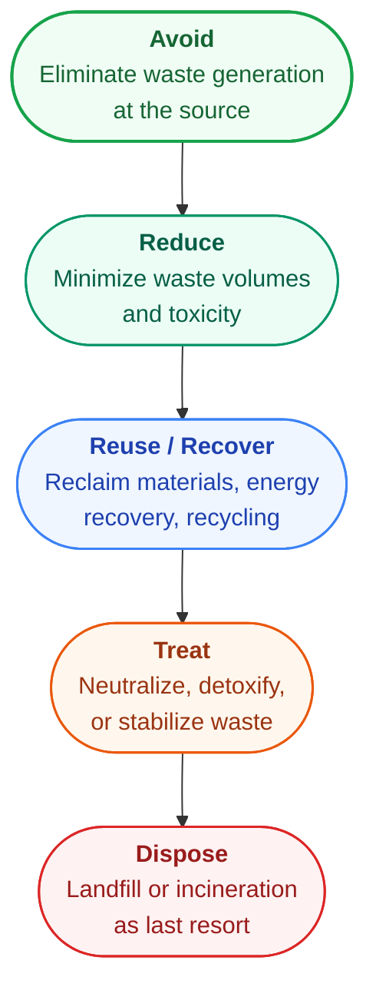

{/* source: IFC Performance Standards 2012, Performance Standard 3 */}

## What PS3 Covers

Performance Standard 3 addresses the environmental side of project operations: how efficiently you use resources, what you emit into the atmosphere, what you release into water and soil, and how you handle waste and hazardous materials. It covers six interconnected areas:

1. **Resource efficiency** - energy, water, and raw materials
2. **GHG emissions** - quantification, reporting, and reduction
3. **Pollution prevention** - air, water, and land
4. **Waste management** - from generation through disposal
5. **Hazardous materials** - storage, handling, and banned substances
6. **Pesticide use** - integrated pest management and prohibited chemicals

The standard operates on a simple hierarchy: avoid impacts first. Where avoidance is not feasible, minimize. Where minimization is not enough, control and compensate.

## Resource Efficiency

The client must implement technically and financially feasible measures to improve efficiency in the use of energy, water, and other material resources. "Technically and financially feasible" is doing real work here - it means you cannot dismiss efficiency improvements simply because they are inconvenient, but you also do not have to adopt technologies that would bankrupt the project.

In practice, this means:

- Conducting energy and resource audits during project design
- Adopting industry-recognized benchmarks where they exist (for example, energy intensity per unit of output in manufacturing)
- Monitoring resource consumption over time and identifying trends
- Implementing improvements as part of the project's environmental management system

<AnalogyBox>
Think of resource efficiency under PS3 like managing a household budget. You do not just track how much money goes out each month - you look for patterns, compare against what similar households spend, and find places to cut waste without sacrificing quality of life. The standard asks projects to do the same with energy, water, and materials.
</AnalogyBox>

## GHG Emissions

PS3 sets a clear quantitative threshold that triggers mandatory obligations.

<HighlightBox>
If a project is expected to or does produce more than 25,000 tonnes of CO2-equivalent per year, the client must quantify both direct emissions (Scope 1) and indirect emissions from purchased energy (Scope 2). These must be reported annually using internationally recognized methodologies such as the GHG Protocol or IPCC guidelines. Below 25,000 tCO2e/year, quantification is encouraged but not required.
</HighlightBox>

For projects above the threshold, the requirements are specific:

- **Quantify** direct emissions from sources owned or controlled by the project
- **Quantify** indirect emissions from off-site generation of purchased electricity, heat, or steam
- **Report annually** with consistent methodology
- **Evaluate technically and financially feasible options** to reduce or offset emissions during project design and operation

The 25,000 tCO2e threshold is roughly equivalent to a mid-size manufacturing facility or a 10 MW coal-fired power plant. Projects well below this level - an office building, a small hospitality operation - typically do not trigger mandatory GHG reporting under PS3, though they may face requirements under other standards or national regulations.

### The Six Kyoto Protocol GHGs

GHG quantification under PS3 covers the six greenhouse gases regulated by the Kyoto Protocol. Each gas has a different Global Warming Potential (GWP) - its heat-trapping ability relative to CO₂ over a 100-year period. These GWP values are used to convert all emissions into a common unit: tonnes of CO₂-equivalent (tCO₂e).

<ResponsiveTable>

| Greenhouse Gas | Chemical Formula | GWP (100-year) | Common Sources |
|---|---|---|---|
| Carbon dioxide | CO₂ | 1 | Fossil fuel combustion, cement production, land clearing |
| Methane | CH₄ | 25 | Landfills, livestock, natural gas systems, rice cultivation |
| Nitrous oxide | N₂O | 298 | Fertilizer use, combustion, industrial processes |
| Hydrofluorocarbons | HFCs | Varies (up to 14,800) | Refrigeration, air conditioning, foam blowing |
| Perfluorocarbons | PFCs | Varies (up to 12,200) | Aluminum smelting, semiconductor manufacturing |
| Sulfur hexafluoride | SF₆ | 22,800 | Electrical switchgear insulation, magnesium processing |

</ResponsiveTable>

<HighlightBox>
SF₆ has a GWP of 22,800 - meaning one tonne of SF₆ has the same warming effect as 22,800 tonnes of CO₂. Even small leaks from electrical switchgear can produce enormous CO₂-equivalent emissions. A project using SF₆-insulated equipment should track and minimize leakage rates carefully - replacing a single leaking circuit breaker could save thousands of tCO₂e annually.
</HighlightBox>

### Scope 1 vs Scope 2 Emissions

**Scope 1 (direct emissions)** covers GHG emissions from sources owned or controlled by the project. This includes on-site combustion (boilers, generators, vehicles), process emissions (chemical reactions in cement kilns, steel furnaces), and fugitive emissions (methane leaks from pipelines, refrigerant leaks from cooling systems).

**Scope 2 (indirect emissions)** covers emissions from the off-site generation of purchased electricity, heat, or steam consumed by the project. The project does not directly emit these GHGs, but its energy demand drives the emissions at the power plant.

Both scopes must be quantified and reported annually for projects exceeding the 25,000 tCO₂e/year threshold. The Guidance Notes recommend using the GHG Protocol Corporate Standard or IPCC Guidelines as the quantification methodology.

### Sector-Specific GHG Thresholds

Annex A of Guidance Note 3 provides sector-specific thresholds to help identify which projects are likely to exceed 25,000 tCO₂e/year and therefore trigger mandatory quantification. If a project meets or exceeds these capacity thresholds, GHG emissions are virtually certain to be significant.

<ResponsiveTable>

| Sector | Capacity Threshold |
|---|---|
| Coal-fired power generation | ≥4.5 MW thermal input |
| Gas-fired power generation | ≥10.5 MW thermal input |
| Cement production | ≥33,000 tonnes/year clinker |
| Iron and steel production | ≥25,000 tonnes/year |

</ResponsiveTable>

<ExampleBox>
**Example: Using sector thresholds in screening**

A proposed cement plant will produce 50,000 tonnes of clinker per year. The sector threshold is 33,000 tonnes/year - so this plant is virtually certain to exceed 25,000 tCO₂e/year. The project team does not need to wait for detailed emissions calculations to know that full Scope 1 and Scope 2 quantification will be required. They should build GHG monitoring and reporting into the project design from the start, not as an afterthought.
</ExampleBox>

## Pollution Prevention

The core principle is avoidance. Where avoidance is not feasible, the client must minimize and control the intensity and mass flow of pollutant releases. This applies to:

- **Routine releases** - normal operational discharges (stack emissions, treated wastewater)
- **Non-routine releases** - upset conditions, process upsets, maintenance activities
- **Accidental releases** - spills, leaks, equipment failures

When determining acceptable pollution levels, the project must consider:

- Existing ambient conditions (is the air or water already degraded?)
- The assimilative capacity of the receiving environment
- Proximity to ecologically sensitive areas or populated centers
- Cumulative impacts from other existing or planned projects in the area

The applicable standard is whichever is more stringent: host country regulations or the World Bank Group's Environmental, Health and Safety (EHS) Guidelines. In many developing countries, the EHS Guidelines set the binding standard because national limits are either absent or less protective.

### Cleaner Production

The Guidance Notes emphasize **cleaner production** as the preferred approach to pollution prevention. Cleaner production is a systematic methodology for preventing pollution at the source - rather than capturing, treating, or disposing of pollutants after they have been generated (the "end-of-pipe" approach).

In practice, cleaner production means:

- Substituting less toxic raw materials for more toxic ones
- Modifying production processes to generate less waste
- Improving maintenance and housekeeping to prevent leaks and spills
- Redesigning products to reduce environmental impact during use and disposal
- Recovering and reusing materials within the production process

The logic is straightforward: pollution that is never created does not need to be treated. End-of-pipe controls (scrubbers, filters, treatment plants) add cost and create secondary waste streams. Cleaner production eliminates or reduces the problem upstream.

### The 25% Assimilative Capacity Rule

When evaluating whether a project's emissions and discharges are acceptable, the Guidance Notes introduce a critical benchmark: **project emissions should not exceed 25% of the receiving environment's assimilative capacity**. Assimilative capacity is the ability of the surrounding air, water, or soil to absorb pollutants without exceeding ambient quality standards or causing ecological harm.

<HighlightBox>
The 25% rule serves as a precautionary buffer. If a project consumed 100% of the assimilative capacity, there would be zero room for other sources - existing or future. By limiting any single project to 25%, the standard preserves headroom for cumulative impacts from other activities in the area and accounts for uncertainty in modeling ambient conditions.
</HighlightBox>

Where existing ambient conditions are already degraded (the area is already near or above pollution thresholds), even 25% of remaining capacity may be too much. In such cases, the project may need to achieve near-zero incremental emissions for the relevant pollutants - or demonstrate that its operation will actually improve ambient conditions through offsets or displacement of dirtier existing sources.

## Waste Management

PS3 establishes a clear hierarchy for waste, and it is not optional - it reflects the order of preference that every project must follow.

Each step down the hierarchy represents a less desirable outcome. Disposal - landfilling or incineration without energy recovery - is the last resort, not the default.

For **hazardous waste** specifically, the requirements are tighter:

- Use licensed contractors for transport and disposal
- Maintain **chain of custody documentation** from generation through final disposal
- Verify that disposal facilities operate to acceptable standards
- Avoid exporting hazardous waste to countries that lack the capacity to handle it safely

## Hazardous Materials

The client must avoid the use of hazardous materials where technically and financially feasible alternatives exist. Where hazardous materials are necessary, the project must minimize quantities and control handling, storage, and transport to prevent releases.

Two international treaties set absolute boundaries:

- **Stockholm Convention** - bans or severely restricts persistent organic pollutants (POPs) such as DDT, PCBs, and dioxins. Projects must not manufacture, trade, or use substances listed under the Convention unless a specific exemption applies.
- **Montreal Protocol** - phases out ozone-depleting substances (ODS) such as CFCs and HCFCs. Projects must not use ODS where alternatives are available, and must phase out any remaining use in line with the Protocol's schedule.

### Risk Assessment for Hazardous Materials

For projects involving significant quantities of hazardous materials, the Guidance Notes recommend formal risk assessment methodologies:

- **HAZID (Hazard Identification)** - a structured brainstorming exercise to identify all potential hazards associated with the project's operations, materials, and location. This is typically the first step, casting a wide net.
- **HAZOP (Hazard and Operability Study)** - a more detailed, systematic review of process design. A multidisciplinary team examines each stage of the process to identify deviations from intended operation and their potential consequences.
- **QRA (Quantitative Risk Assessment)** - the most rigorous level. QRA assigns numerical probabilities to identified hazards and models their consequences (blast radii, toxic gas dispersion, fire envelopes) to determine whether risk levels are acceptable. QRA is typically required for major hazard facilities - large chemical plants, LNG terminals, refineries.

These are not optional extras for high-risk projects. If a facility stores or processes large quantities of flammable, explosive, or toxic materials, IFC will expect to see formal hazard assessment appropriate to the level of risk.

## Pesticide Use

Where pest management is needed, PS3 requires an **Integrated Pest Management (IPM)** approach first. IPM combines biological controls, habitat management, crop rotation, and other non-chemical methods to manage pests. Chemical pesticides are a last resort.

For projects involving disease vector control (malaria, dengue, etc.), the equivalent approach is **Integrated Vector Management (IVM)** - combining environmental management (eliminating breeding sites), biological control (larvivorous fish, bacterial agents), and community engagement before resorting to chemical insecticides. IVM follows the same logic as IPM: non-chemical methods first, chemicals only when necessary and with proper controls.

When chemical pesticides are used, the rules are specific:

- **WHO Class Ia (extremely hazardous) and Class Ib (highly hazardous) pesticides are prohibited** outright - no exceptions
- **WHO Class II (moderately hazardous) pesticides** may be used only with appropriate controls: trained applicators, proper equipment, restricted application areas, and monitoring
- Any pesticide use must comply with the FAO International Code of Conduct on Pesticide Management

<AnalogyBox>
Think of IPM and IVM like treating a medical condition. You do not jump straight to surgery (heavy chemical use). You start with lifestyle changes (habitat management, crop rotation), then try medication (biological controls), and only resort to surgery (chemical pesticides) when less invasive options have failed - and even then, you use the minimum effective dose with full monitoring.
</AnalogyBox>

<ExampleBox>
**Example: A manufacturing plant applying PS3**

A medium-scale chemical manufacturing facility in Southeast Asia triggers PS3 requirements across multiple areas:

- **Resource efficiency:** The plant conducts an energy audit and discovers that upgrading to variable-speed drives on pumps and compressors would cut electricity use by 18%. Water recycling in the cooling system could reduce freshwater intake by 40%. Both measures are technically feasible and pay back within 3 years - so PS3 requires implementation.

- **GHG emissions:** The plant emits approximately 35,000 tCO2e/year from on-site combustion and purchased electricity. This exceeds the 25,000 tCO2e threshold, so the client must quantify Scope 1 and Scope 2 emissions using the GHG Protocol and report annually.

- **Pollution prevention:** The plant generates wastewater containing organic solvents and heavy metals. National discharge limits exist but are less protective than the EHS Guidelines. The plant must meet the EHS Guidelines (whichever is more stringent), install appropriate wastewater treatment, and monitor discharge quality.

- **Waste management:** Chemical residues classified as hazardous waste must be transported by a licensed hauler with chain of custody documentation to a licensed treatment facility. The plant also generates non-hazardous packaging waste, which it sends for recycling (reuse/recover level of the hierarchy) rather than landfill.

- **Hazardous materials:** The plant stores chlorine gas and sulfuric acid on site. Storage areas must meet international safety standards, with secondary containment, emergency response equipment, and trained personnel. If the plant previously used a PCB-containing transformer oil (a Stockholm Convention substance), it must replace it.
</ExampleBox>

## Putting It Together

PS3 is fundamentally about discipline in how a project interacts with the physical environment. The standard does not demand zero emissions or zero waste - it demands that you measure what matters, avoid what you can, minimize what you cannot avoid, and control what remains.

The 25,000 tCO2e threshold, the waste hierarchy, the pesticide classifications, and the pollution benchmarks are not arbitrary. They create concrete decision points where a project either meets the standard or does not. There is very little room for interpretation on the hard limits - you either use WHO Class Ia pesticides or you do not, you either quantify your GHG emissions above the threshold or you do not.

<KeyTakeaways items="Projects emitting over 25,000 tCO₂e per year must quantify and annually report both Scope 1 (direct) and Scope 2 (indirect) GHG emissions ;; Six Kyoto Protocol GHGs must be tracked - CO₂, CH₄, N₂O, HFCs, PFCs, and SF₆ - each converted to CO₂e using their GWP values ;; Sector-specific thresholds help screen projects - e.g., coal power ≥4.5 MW, cement ≥33,000 t/yr clinker virtually guarantee exceeding 25,000 tCO₂e ;; Cleaner production (preventing pollution at source) is preferred over end-of-pipe treatment ;; Project emissions should not exceed 25% of receiving environment's assimilative capacity ;; The waste hierarchy applies - avoid first, then reduce, reuse, recover, and dispose as last resort ;; WHO Class Ia and Ib pesticides are prohibited outright - IPM and IVM required before any chemical use ;; HAZID, HAZOP, and QRA are the standard risk assessment methodologies for hazardous materials ;; Whichever is more stringent applies - host country pollution standards or EHS Guidelines" />
