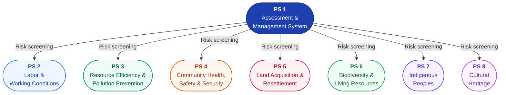

{/* source: IFC Performance Standards, Overview; Guidance Notes Introduction */}

## PS 1 Is the Backbone

Every IFC-financed project needs PS 1. There are no exceptions. PS 1 requires the client to establish an Environmental and Social Management System (ESMS), conduct risk and impact identification, and engage affected stakeholders. That process - the risk identification under PS 1 - is what determines which of PS 2 through PS 8 apply to any given project.

Think of it this way: PS 1 asks the question "what could go wrong?" and PS 2-8 tell you what to do about each specific category of risk.

## Cross-Cutting Themes

The eight standards are not siloed. Several themes weave across multiple standards:

<ResponsiveTable>

| Theme | Standards Where It Appears | Examples |
|-------|---------------------------|----------|
| Climate change | PS 1, PS 3 | GHG quantification (PS 3), climate risk in ESIA (PS 1) |
| Human rights | PS 1, PS 2, PS 5, PS 7 | Labor rights (PS 2), displacement (PS 5), indigenous rights (PS 7), due diligence (PS 1) |
| Gender | PS 1, PS 2, PS 5, PS 7 | Non-discrimination (PS 2), gendered resettlement impacts (PS 5), women in indigenous communities (PS 7) |
| Water | PS 3, PS 4, PS 6 | Water efficiency (PS 3), community water supply (PS 4), aquatic habitats (PS 6) |
| Supply chain | PS 2, PS 6 | Supply chain labor risks (PS 2), sustainable sourcing of living natural resources (PS 6) |

</ResponsiveTable>

This is why the standards must be read together, not in isolation. A water-related risk doesn't sit neatly in one standard - it might implicate resource efficiency (PS 3), community health (PS 4), and biodiversity (PS 6) simultaneously.

### Ecosystem Services - A Thread Across All Eight Standards

Ecosystem services are not confined to PS 6. The Guidance Notes (GN6, Annex A) show how ecosystem services appear across every standard, often under different terminology:

<ResponsiveTable>

| Standard | How Ecosystem Services Appear | Terminology Used |
|---|---|---|
| **PS 1** | Area of influence includes ecosystem services that affected communities depend on | "Area of influence," risk identification |
| **PS 2** | OHS risks from environmental hazards affecting workers | Workplace environment |
| **PS 3** | Resource efficiency directly relates to regulating and provisioning services | Water, energy, raw materials |
| **PS 4** | Priority ecosystem services linked to community health, safety, and livelihoods | "Ecosystem services upon which affected communities' health or livelihood depends" |
| **PS 5** | "Natural resource assets" lost through displacement are provisioning ecosystem services | "Natural resource-based livelihoods and assets" |
| **PS 6** | Primary standard for ecosystem services assessment and management | "Ecosystem services," "priority ecosystem services" |
| **PS 7** | "Natural resources and natural areas of importance" to Indigenous Peoples are priority ecosystem services | "Natural resources," "lands and territories" |
| **PS 8** | "Unique natural features with cultural values" are cultural ecosystem services | "Natural features of cultural significance" |

</ResponsiveTable>

<HighlightBox>
When assessing ecosystem services impacts, do not look only at PS 6. A project that degrades a river's water purification capacity (a regulating service) could simultaneously trigger PS 3 (resource efficiency), PS 4 (community water supply), PS 5 (loss of fishing livelihoods for displaced communities), and PS 7 (impacts on indigenous resource use). Map the ecosystem service to every standard it touches.
</HighlightBox>

## The Mitigation Hierarchy Runs Through Everything

Every standard applies the same fundamental logic:

1. **Avoid** the impact entirely where feasible
2. **Minimize** the impact where avoidance is not possible
3. **Restore** or **compensate** for residual impacts
4. **Offset** only as a last resort (particularly for biodiversity under PS 6)

Whether the issue is worker safety (PS 2), pollution (PS 3), displacement (PS 5), or habitat loss (PS 6), the client must demonstrate it has worked through this sequence. Jumping straight to compensation without first trying to avoid and minimize is non-compliant.

## Stakeholder Engagement Connects All Standards

PS 1 requires stakeholder engagement as a core element of the ESMS. But it doesn't stop there - stakeholder engagement is the thread that connects every standard to the people affected:

- Communities exposed to **pollution or resource depletion** (PS 3) need to be consulted on mitigation measures
- People facing **resettlement** (PS 5) must participate in developing the Resettlement Action Plan
- Communities near projects affecting **biodiversity** (PS 6) need to understand and input on offset plans
- **Indigenous Peoples** (PS 7) have the right to FPIC for impacts on lands, resources, and cultural heritage
- Impacts on **cultural heritage** (PS 8) require consultation with affected communities and heritage authorities

## Project Categorization

IFC categorizes every project based on the magnitude of its potential environmental and social risks. The category determines the depth of assessment required:

<ResponsiveTable>

| Category | Risk Level | Assessment Required | Examples |
|----------|-----------|---------------------|----------|
| **A** | Significant adverse impacts - diverse, irreversible, or unprecedented | Full Environmental and Social Impact Assessment (ESIA) | Large dams, oil refineries, greenfield mines |
| **B** | Limited adverse impacts - few, site-specific, largely reversible | Focused E&S assessment of specific issues | Small-scale manufacturing, hotel construction |
| **C** | Minimal or no impacts | Basic E&S review | Software companies, financial advisory services |
| **FI** | Financial intermediary investing in sub-projects | Develop an ESMS proportionate to risk of sub-projects | Commercial banks, private equity funds |

</ResponsiveTable>

A Category A project will always require the most rigorous application of all applicable standards, including a comprehensive ESIA with public disclosure and consultation. A Category B project still needs to meet the standards, but the assessment can be narrower and more focused.

<HighlightBox>
Over **130 financial institutions** in 38 countries have adopted the IFC Performance Standards through the **Equator Principles**. When an Equator Principles signatory bank finances a project above $10 million, it applies IFC PS as the environmental and social benchmark - regardless of whether IFC is involved. This makes the Performance Standards the de facto global standard for project finance E&S risk management, reaching far beyond IFC's own portfolio.
</HighlightBox>

## PS and Other Frameworks

The Performance Standards don't exist in a vacuum. They sit at the center of a wider ecosystem:

- **Equator Principles** - 130+ signatory banks apply IFC PS to project finance globally
- **Development Finance Institutions (DFIs)** - Many bilateral and multilateral DFIs reference IFC PS as their minimum E&S standard
- **EU Taxonomy** - The minimum social safeguards in the EU Taxonomy reference the IFC Performance Standards and related instruments
- **Export Credit Agencies** - OECD Common Approaches reference IFC PS for environmental and social due diligence

<ExampleBox>
**A Large Infrastructure Project Triggering All Eight Standards**

Consider a proposed copper mine in a mountainous region of Southeast Asia. The site sits in a forested valley, upstream of several farming communities, within the traditional territory of an indigenous group, and near ancient temple ruins.

- **PS 1**: Full ESMS required. Category A project - comprehensive ESIA with public disclosure
- **PS 2**: 3,000+ construction workers, many migrant. Labor management plan, OHS protocols, supply chain due diligence
- **PS 3**: Tailings management, acid mine drainage controls, GHG quantification (diesel generators, processing), water recycling
- **PS 4**: Downstream communities at risk from tailings dam failure. Emergency response plan, dam safety protocols, security personnel code of conduct
- **PS 5**: 200 households need physical displacement, 500 farming families lose access to agricultural land. Full Resettlement Action Plan with livelihood restoration
- **PS 6**: Project footprint overlaps critical habitat for an endangered primate. Biodiversity offset required - net gain commitment
- **PS 7**: Indigenous community has customary land rights. FPIC required for impacts on land, cultural identity, and natural resources
- **PS 8**: Ancient temple complex within the project's area of influence. Cultural heritage management plan, chance find procedures for construction phase

This is not unusual for large extractive or infrastructure projects. The standards are designed to handle exactly this kind of complexity - and that's why they must be read as an integrated package.
</ExampleBox>

## Key Screening and Assessment Tools

Practitioners should know the standard toolset for environmental and social screening. These are the databases and frameworks that IFC expects clients and consultants to use:

- **IBAT (Integrated Biodiversity Assessment Tool)** - the primary screening tool for biodiversity risk. Pulls data from IUCN Red List, World Database on Protected Areas, and Key Biodiversity Areas. Use it early to flag sensitive habitats before site selection is final
- **IUCN Red List of Threatened Species** and **Red List of Ecosystems** - the global authority for species and ecosystem conservation status. Any Critically Endangered or Endangered species in the project area will trigger critical habitat considerations under PS 6
- **World Database on Protected Areas (WDPA)** - maintained by UNEP-WCMC. Identifies legally protected areas and their IUCN management categories. Overlap with a protected area has immediate implications for PS 6 and often PS 8
- **AZE (Alliance for Zero Extinction) Sites** - sites that hold the last remaining population of an Endangered or Critically Endangered species. Any AZE site overlap is a strong indicator of critical habitat
- **IFC Environmental, Health and Safety (EHS) Guidelines** - sector-specific technical guidance covering pollution prevention, occupational health, community safety, and construction practices. These are the "how-to" companion to the Performance Standards and are referenced throughout PS 3 and PS 4
- **WRI Corporate Ecosystem Services Review** - a structured methodology for identifying business risks and opportunities related to ecosystem services. Useful for the ecosystem services assessment required under PS 6

<AnalogyBox>
Think of these tools as the diagnostic instruments a doctor uses before prescribing treatment. IBAT and the IUCN Red List are the blood tests - they tell you what's present and at risk. The WDPA is the X-ray - it shows protected zones you must not damage. The IFC EHS Guidelines are the treatment protocols - they tell you the standard of care once you know what you're dealing with. Skipping the diagnostics and going straight to treatment is malpractice - in both medicine and project development.
</AnalogyBox>

## Practical Tips for Implementation

For practitioners applying the standards to real projects:

1. **Start with PS 1's ESMS** - Build the management system first. Without it, managing PS 2-8 requirements becomes ad hoc and unsustainable
2. **Conduct thorough risk screening** - The initial E&S risk identification determines everything. Miss a risk category early, and you'll miss an applicable standard
3. **Determine which PS 2-8 apply** - Not every standard applies to every project. Document why specific standards do or don't apply based on your risk screening
4. **Develop management plans for each applicable standard** - Each triggered standard needs its own action plan with clear responsibilities, timelines, and monitoring indicators. Define specific KPIs for each plan - vague commitments like "minimize impacts" are not management plans
5. **Build stakeholder engagement into everything** - Don't treat engagement as a standalone activity. Integrate it into risk identification, management planning, and monitoring
6. **Monitor and report** - The ESMS is not a one-time exercise. Ongoing monitoring, reporting, and adaptive management are required throughout the project lifecycle
7. **Budget for external specialists** - The Performance Standards require competent professionals. Heritage specialists for PS 8, biodiversity ecologists for PS 6, social development practitioners for PS 5 and PS 7, indigenous peoples experts for PS 7, and OHS professionals for PS 2 are not optional expenses - they are requirements. Under-resourcing expert input is one of the most common causes of non-compliance
8. **Think across the full project lifecycle** - Requirements apply through construction, operations, and decommissioning. A biodiversity offset designed only for the construction phase will fail if operational impacts continue for 25 years. Design management plans with the full project timeline in mind
9. **Embrace adaptive management** - The ESMS and associated management plans are living documents. As new information emerges - from monitoring data, stakeholder feedback, or changes in project design - plans must be updated. A management plan written in 2024 and never revised by 2030 is almost certainly inadequate

<KeyTakeaways items="PS 1 is always applicable - the ESMS and risk identification process determines which of PS 2-8 are triggered ;; Cross-cutting themes like climate change, human rights, gender, and water appear across multiple standards ;; Over 130 financial institutions apply the Performance Standards through the Equator Principles - making these the de facto global standard ;; The standards must be read together - a single project can trigger all eight simultaneously" />
