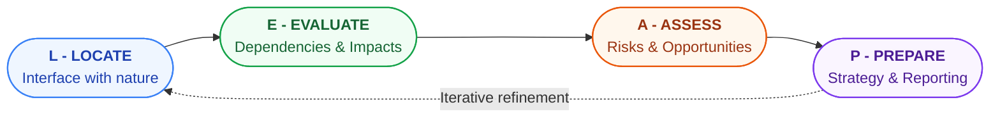

{/* source: TNFD LEAP Guidance v2, Overview */}

<h2 class="text-2xl font-bold text-gray-800 mb-4">The LEAP Approach: Locate, Evaluate, Assess, Prepare</h2>

<HighlightBox>
  
TNFD's practical assessment methodology

  
The LEAP Approach is TNFD's structured methodology for identifying and assessing nature-related dependencies, impacts, risks, and opportunities. Unlike the four disclosure pillars, which describe what to report, LEAP describes how to conduct the underlying assessment. It is the analytical engine that powers TNFD-aligned disclosure and is designed to be applied iteratively, improving in depth and precision over multiple reporting cycles.

</HighlightBox>

<h3 class="text-xl font-bold mt-6 mb-3">Why a Structured Assessment Approach?</h3>

Nature-related issues are inherently complex, location-specific, and multidimensional. Without a structured methodology, organisations risk producing disclosures that are either too vague to be useful (listing "water" as a dependency without any quantification or geographic anchoring) or so overwhelming in scope that they cannot be acted upon.

LEAP was developed through an 18-month collaborative process involving TNFD Taskforce members, knowledge partners, and over 500 organisations that piloted the framework's beta versions. It was designed to be sector-agnostic and scalable, applicable by a small producer cooperative and a global financial institution alike, while providing enough specificity to generate comparable, decision-useful outputs.

<h3 class="text-xl font-bold mt-6 mb-3">The LEAP Structure: An Overview</h3>

LEAP comprises four sequential phases, each containing multiple analytical steps. The phases are designed to be iterative rather than linear: organisations may need to revisit earlier steps as they gather new information in later phases. The four phases are:

<ul class="list-disc ml-6 space-y-2 mb-4">
  <li><strong>L - Locate:</strong> Where does the organisation interface with nature?</li>
  <li><strong>E - Evaluate:</strong> What are the organisation's dependencies and impacts on nature in those locations?</li>
  <li><strong>A - Assess:</strong> What are the material risks and opportunities arising from those dependencies and impacts?</li>
  <li><strong>P - Prepare:</strong> What are the organisation's response strategies, and how should it report?</li>
</ul>

<h3 class="text-xl font-bold mt-6 mb-3">Phase L: Locate - Where Does the Organisation Interface with Nature?</h3>

The Locate phase establishes the geographic and ecological footprint of the organisation's activities and supply chain. It produces a prioritised map of where the organisation interacts with nature, providing the foundation for all subsequent analysis.

The key analytical questions in the Locate phase are:

<ul class="list-disc ml-6 space-y-2 mb-4">
  <li>What are the organisation's business activities and processes (direct operations, upstream supply chain, downstream activities)?</li>
  <li>Where are these activities located geographically? What biomes, ecosystems, and jurisdictions do they span?</li>
  <li>Do any of these locations overlap with, or are they in proximity to, priority locations for nature (Key Biodiversity Areas, protected areas, wetlands of international importance, Indigenous lands)?</li>
  <li>What is the ecological sensitivity and integrity of the ecosystems at or near these locations?</li>
</ul>

TNFD defines <strong>priority locations</strong> as sites that are particularly sensitive to human interference, designated for biodiversity protection, or critical for ecosystem function. Examples include IUCN protected areas, Ramsar Wetlands, UNESCO Natural World Heritage Sites, KBA (Key Biodiversity Areas), and the habitats of IUCN Red List species.

The practical output of the Locate phase is a <strong>geographic inventory</strong> of the organisation's nature-related interfaces, ranked by ecological sensitivity and business significance. Digital tools including the Integrated Biodiversity Assessment Tool (IBAT), World Resources Institute's Aqueduct platform, and the ENCORE (Exploring Natural Capital Opportunities, Risks and Exposure) tool support this analysis.

<ExampleBox>
  
Example: Locate Phase for a Textile Manufacturer

  
A global textile manufacturer begins the Locate phase by mapping its 120 tier-1 cotton suppliers across India, Bangladesh, Egypt, and the United States. Using the IBAT tool, it identifies that 34 suppliers operate within 50 km of Key Biodiversity Areas. Using WRI Aqueduct, it flags that 28 suppliers are in "extremely high" water stress areas. The Locate phase has now produced a prioritised subset of 34-28 overlapping high-risk locations for deeper analysis in the Evaluate phase, rather than requiring the company to assess all 120 suppliers with equal depth.

</ExampleBox>

<h3 class="text-xl font-bold mt-6 mb-3">Phase E: Evaluate - What Are the Organisation's Dependencies and Impacts?</h3>

The Evaluate phase analyses the specific nature-related dependencies and impacts associated with the priority locations identified in the Locate phase. It is the most analytically demanding phase and requires engagement with sector-specific expertise.

For <strong>dependencies</strong>, the Evaluate phase asks:

<ul class="list-disc ml-6 space-y-2 mb-4">
  <li>Which ecosystem services does each business process rely on (water provisioning, pollination, soil regulation, climate regulation, disease regulation)?</li>
  <li>What is the criticality of each dependency (how easily can the service be substituted, and what is the cost if it degrades)?</li>
  <li>What is the current condition and trajectory of each ecosystem service at priority locations?</li>
</ul>

For <strong>impacts</strong>, the Evaluate phase asks:

<ul class="list-disc ml-6 space-y-2 mb-4">
  <li>What impact drivers are generated by business activities (land use change, water extraction, GHG emissions, pollution loading, species disturbance, introduction of invasive species)?</li>
  <li>What is the magnitude, extent, duration, reversibility, and likelihood of each impact?</li>
  <li>Are impacts occurring in ecologically sensitive locations?</li>
</ul>

The ENCORE tool, developed by UNEP-WCMC and Global Canopy, provides a sector-specific mapping of dependencies on ecosystem services across 167 business processes, making it a valuable starting point for the dependency analysis. ENCORE maps 21 ecosystem services (provisioning, regulating, and cultural) against 167 business processes across 11 sectors, using a high/medium/low dependency rating based on the scientific literature.

<h3 class="text-xl font-bold mt-6 mb-3">Phase A: Assess - What Are the Risks and Opportunities?</h3>

The Assess phase translates the dependency and impact analysis from the Evaluate phase into financial risks and opportunities, applying the organisation's enterprise risk management framework. It is the bridge between ecological analysis and financial disclosure.

TNFD categorises nature-related risks into three types:

<ResponsiveTable>
<table class="mb-6">
  <tr><th>Risk Type</th><th>Definition</th><th>Example</th></tr>
  <tr><td>Physical risks</td><td>Risks arising from the degradation or loss of ecosystem services that the organisation depends on</td><td>Reduced freshwater availability due to watershed deforestation affecting a beverage factory</td></tr>
  <tr><td>Transition risks</td><td>Risks arising from policies, market shifts, technology changes, or reputational effects related to nature</td><td>EU Deforestation Regulation requiring supply chain due diligence, threatening market access</td></tr>
  <tr><td>Systemic risks</td><td>Risks arising from the breakdown of ecosystem services at a scale that affects economic systems broadly</td><td>Collapse of pollinators in a major agricultural region affecting food system stability and multi-sector credit quality</td></tr>
</table>
</ResponsiveTable>

For each identified risk, the Assess phase should characterise:

<ul class="list-disc ml-6 space-y-2 mb-4">
  <li>The <strong>likelihood</strong> of the risk materialising over the relevant time horizon.</li>
  <li>The <strong>magnitude of impact</strong> on the organisation's revenues, costs, assets, or liabilities.</li>
  <li>The organisation's <strong>resilience</strong> to the risk (existing adaptation measures, strategic optionality).</li>
</ul>

<AnalogyBox>
  
Analogy: LEAP as a Medical Examination

  
Locate is like identifying which organs and systems to examine based on where the patient (your operations) is exposed to environmental stressors. Evaluate is the diagnostic phase: running tests to understand the specific condition of each organ and how it depends on other systems. Assess is the diagnosis: translating test results into clinical risks ranked by severity and urgency. Prepare is the treatment plan: deciding which interventions to prioritise, what medications to prescribe (mitigation measures), and what to tell the patient's family (disclosing to investors and stakeholders). The examination must be repeated annually because conditions change.

</AnalogyBox>

<h3 class="text-xl font-bold mt-6 mb-3">Phase P: Prepare - Strategy, Response, and Reporting</h3>

The Prepare phase translates the risk and opportunity assessment into strategic responses and TNFD-aligned disclosures. It has two main outputs: a <strong>response strategy</strong> (how the organisation will address material nature-related issues) and <strong>disclosure content</strong> (what will be reported under the four TNFD pillars).

Response strategies may include:

<ul class="list-disc ml-6 space-y-2 mb-4">
  <li><strong>Avoidance:</strong> Redesigning operations or supply chains to eliminate or reduce nature impacts (e.g., shifting sourcing away from high-biodiversity-sensitivity regions).</li>
  <li><strong>Reduction:</strong> Implementing best practices to reduce dependency vulnerabilities and impact drivers (e.g., precision irrigation to reduce water extraction; pesticide reduction programs).</li>
  <li><strong>Restoration:</strong> Investing in ecosystem restoration within or adjacent to operational areas to rebuild natural capital stocks and reduce physical risk.</li>
  <li><strong>Transformation:</strong> Fundamentally redesigning business models to decouple growth from nature degradation (e.g., shifting from animal-based to plant-based protein production).</li>
  <li><strong>Engagement:</strong> Working with suppliers, governments, communities, and peers to address nature challenges that exceed what any single organisation can resolve alone.</li>
</ul>

<h3 class="text-xl font-bold mt-6 mb-3">LEAP and the Four TNFD Pillars: Integration</h3>

LEAP generates the analytical inputs that populate the four TNFD disclosure pillars. The integration works as follows:

<ResponsiveTable>
<table class="mb-6">
  <tr><th>LEAP Phase</th><th>Primary TNFD Pillar(s) Fed</th><th>Specific Disclosures Supported</th></tr>
  <tr><td>Locate</td><td>Strategy</td><td>S4 (priority locations disclosure)</td></tr>
  <tr><td>Evaluate</td><td>Strategy, Metrics and Targets</td><td>S1 (DIROs identified), MT2 (dependency/impact metrics)</td></tr>
  <tr><td>Assess</td><td>Strategy, Risk and Impact Management</td><td>S2 (effect on business model), R1 (risk identification processes)</td></tr>
  <tr><td>Prepare</td><td>All four pillars</td><td>Full disclosure population including targets (MT3), governance (G1, G2), and scenario resilience (S3)</td></tr>
</table>
</ResponsiveTable>

<DeepDive title="Applying LEAP at Different Maturity Levels">
  TNFD acknowledges that organisations are at very different stages of nature-related risk awareness and data capability. The LEAP Approach is designed to be applied at different levels of depth depending on organisational maturity. First-time reporters might complete a "desktop" LEAP using publicly available tools (ENCORE, IBAT, WRI Aqueduct, Global Forest Watch) to identify priority locations and high-level dependencies, without yet conducting detailed site-level assessments. More mature reporters might commission primary ecological surveys, develop proprietary biodiversity footprint models, and integrate real-time satellite monitoring of land cover change in their supply chains. TNFD explicitly encourages a "start somewhere, improve over time" approach, provided that each iteration is clearly scoped and the limitations of the assessment are disclosed.
</DeepDive>

<KeyTakeaways items="LEAP (Locate, Evaluate, Assess, Prepare) is TNFD's structured four-phase methodology for identifying and assessing nature-related dependencies, impacts, risks, and opportunities before translating them into disclosures ;; The Locate phase establishes the geographic and ecological footprint of operations and supply chains, identifying priority locations (KBAs, protected areas, wetlands) requiring deeper assessment ;; The Evaluate phase analyses specific dependencies on ecosystem services and impact drivers at priority locations, supported by tools like ENCORE, IBAT, and WRI Aqueduct ;; The Assess phase translates ecological analysis into financial risks (physical, transition, and systemic) and opportunities, providing the quantified inputs for TNFD disclosure ;; LEAP feeds all four TNFD disclosure pillars and is designed to be applied iteratively, improving in depth and precision across reporting cycles rather than being completed perfectly in one pass" />
